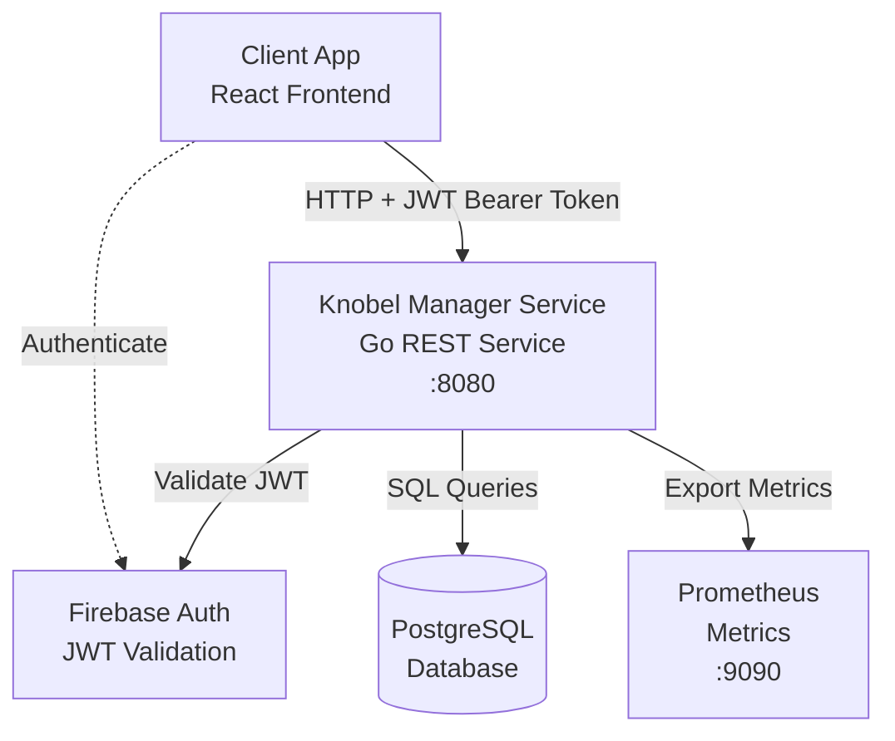

# CLAUDE.md

This file provides guidance to Claude Code (claude.ai/code) when working with code in this repository.

## Project Overview

This is a Go REST API service for managing "Knobeln/Schocken" (dice game) tournaments. It provides endpoints for
managing games, teams, players, rounds, tables, and scores. The project uses OpenAPI-first design with generated server
code, PostgreSQL for persistence, and Firebase JWT for authentication.

Frontend: [knobel-manager-app](https://github.com/henok321/knobel-manager-app) (React)

## Prerequisites

- [Go](https://go.dev/doc/install)
- [Docker](https://docs.docker.com/get-docker/)
- [pre-commit](https://pre-commit.com/) (`pip install pre-commit`)

## Development Commands

### Initial Setup

```bash
make setup
```

Sets up the development environment: installs pre-commit hooks, starts PostgreSQL via Docker Compose, runs database
migrations, and creates `.env` file with credentials.

### Database

```bash
make reset                    # Reset database and pre-commit hooks
docker compose up -d          # Start PostgreSQL manually
docker compose down --volumes # Stop and remove database
```

Migrations are in `db_migration/` directory and use `goose`. Migrations run automatically during setup and deployment.

### OpenAPI Code Generation

```bash
make openapi
```

Generates Go server code from `openapi/openapi.yaml` using `oapi-codegen`. Generated code is placed in `gen/` directory.
Must be run after any OpenAPI spec changes before running lint/test/build.

### Linting

```bash
make lint       # Runs go fmt and golangci-lint (Go only, fast)
make lint-all   # Runs all pre-commit hooks (golangci-lint, sqlfluff, shellcheck, markdownlint, etc.)
```

`make lint` is for quick Go-only linting during development. `make lint-all` runs the complete pre-commit hook suite for
comprehensive validation before committing.

### Testing

```bash
make test                        # Runs all tests
go test -v ./...                # Run tests directly (same as make test)
go test -v ./pkg/game/...       # Run specific package tests
go test -v -run TestName ./...  # Run specific test

# Coverage (manual)
go test ./... -coverpkg=./... -coverprofile=coverage.out  # Generate coverage
go tool cover -html=coverage.out                           # View HTML report
go tool cover -func=coverage.out                           # View text report
```

### Building

```bash
make build     # Builds binary (runs openapi generation first)
make clean     # Removes build artifacts
```

### Running the Application

```bash
# Load environment variables
set -o allexport
source .env
set +o allexport

# Run from source
go run cmd/main.go

# Or run built binary
./knobel-manager-service
```

The service starts two servers:

- Main API server: `http://localhost:8080`
- Metrics server: `http://localhost:9090/metrics` (Prometheus)

Health check: `curl http://localhost:8080/health`

### Update Dependencies

```bash
make update  # Updates pre-commit hooks and Go modules
```

### Available Commands

```bash
make help    # Display all available Makefile targets
```

## Architecture

### System Overview



The system uses:

- **OpenAPI-First**: Server interfaces generated from `openapi/openapi.yaml` using `oapi-codegen`
- **Database**: PostgreSQL with GORM, migrations via `goose`
- **Authentication**: Firebase JWT tokens validated on each request
- **Deployment**: GitHub Actions CI/CD pipeline
- **Monitoring**: Prometheus metrics at `:9090/metrics`, health endpoints at `:8080/health/live` (liveness) and
  `:8080/health/ready` (readiness)

### Code Organization

```shell
cmd/                    # Application entry point
  main.go              # Server initialization, Firebase setup, routing

internal/routes/       # Route configuration
  routes.go            # HTTP route setup with middleware chain

api/                   # HTTP layer
  handlers/            # HTTP handlers implementing OpenAPI interfaces
  middleware/          # Authentication, logging, metrics
  logging/             # Structured logging with context

pkg/                   # Domain modules (independent, reusable)
  game/                # Game management
  team/                # Team management
  player/              # Player management
  table/               # Table/round management
  setup/               # Game setup algorithms (table assignments)
  entity/              # Shared database models
  apperror/            # Application error types

gen/                   # OpenAPI-generated code (DO NOT EDIT MANUALLY)
  health/, games/, teams/, players/, tables/, scores/
                       # Generated types, handler interfaces and routing

openapi/                  # OpenAPI specification
  openapi.yaml         # Main OpenAPI spec
  config/              # oapi-codegen configuration files

db_migration/          # Database migrations (goose)
integrationtests/      # Integration tests using testcontainers
```

### Domain Module Pattern

Each domain module (`pkg/game`, `pkg/team`, `pkg/player`, `pkg/table`) follows this structure:

- `init.go` - Module initialization function (wires repository → service)
- `model.go` - Request/response DTOs
- `repository.go` - Database operations (GORM)
- `service.go` - Business logic

Modules are initialized in `internal/routes/routes.go:93-96` and injected into handlers.

### OpenAPI-First Development

1. Edit `openapi/openapi.yaml` to add/modify endpoints
2. Update relevant config files in `openapi/config/` if needed
3. Run `make openapi` to regenerate server interfaces
4. Implement new interfaces in `api/handlers/`
5. Wire up routes in `internal/routes/routes.go`

The generated code in `gen/` provides:

- Type-safe request/response models
- Server interfaces to implement
- Request validation
- HTTP routing helpers

### Generated Type Usage Pattern

**IMPORTANT: Always use module-specific types.**

oapi-codegen generates types within each module package (`gen/games`, `gen/teams`, `gen/players`, `gen/tables`,
`gen/scores`). Each module contains its own types, ServerInterface definitions, and HTTP routing code. The codebase uses
module-specific types throughout:

**✅ Correct Usage:**

- Use module-specific types: `games.Game`, `teams.Team`, `players.Player`, `tables.Table`, `scores.Score`
- Each module package contains both types AND ServerInterface
- Converters in `api/handlers/converters.go` return module-specific types
- Handlers use module-specific types for requests and responses
- Services use module-specific types for request parameters

**Examples:**

```go
// ✅ Correct - import only the module package you need
import "github.com/henok321/knobel-manager-service/gen/games"

// ✅ Correct - converter returns games.Game
func entityGameToAPIGame(e entity.Game) games.Game { ... }

// ✅ Correct - handler implements games.ServerInterface and uses games.Game
var _ games.ServerInterface = (*GamesHandler)(nil)

func (h *GamesHandler) GetGames(w http.ResponseWriter, r *http.Request) {
apiGames := make([]games.Game, len(allGames))
response := games.GamesResponse{Games: apiGames}
}

// ✅ Correct - service uses games.GameCreateRequest
func (s *gamesService) CreateGame(ctx context.Context, sub string, game *games.GameCreateRequest) (entity.Game, error) { ... }
```

**Why this pattern?**

- Self-contained modules with no cross-dependencies
- Types are scoped to their API context (e.g., `games.Player` represents a player in game responses, while
  `players.Player` represents a player in CRUD operations)
- Simpler configuration - no import-mapping complexity
- Generated code duplication is intentional and correct (same schema, different contexts)
- No workarounds needed for constants or other generated constructs

**Understanding "Duplication":**
Types like `Player`, `Team`, `Table` appear in multiple modules, but this is semantically correct - they represent the
same data structure in different API contexts:

- `games.Player` - Player as part of a game response
- `teams.Player` - Player as part of a team response
- `players.Player` - Player in CRUD operations

This is generated code managed by oapi-codegen. Changes to the OpenAPI schema automatically update all relevant modules
consistently.

**File references:**

- Module types and interfaces: `gen/games/games.gen.go`, `gen/teams/teams.gen.go`, `gen/players/players.gen.go`,
  `gen/tables/tables.gen.go`, `gen/scores/scores.gen.go`
- Converters: `api/handlers/converters.go`
- Handlers: `api/handlers/*_handler.go`
- Services: `pkg/*/service.go`

### Database Models

Core entities in `pkg/entity/model.go`:

- `Game` - Tournament container with configuration (team size, table size, rounds)
- `GameOwner` - Links games to Firebase user IDs
- `Team` - Group of players
- `Player` - Individual participant
- `Round` - Game round container
- `GameTable` - Table assignment for a round
- `Score` - Player score at a specific table
- `TablePlayer` - Many-to-many join table

### Authentication & Authorization

- Uses Firebase JWT tokens via `Authorization: Bearer <token>` header
- Authentication middleware in `api/middleware/auth.go`
- Extracts user ID (`sub`) from token and stores in request context
- Authorization checks happen in services (e.g., verifying game ownership)
- Application errors are handled via `pkg/apperror` package with standardized error types

### Middleware Chain

Public endpoints: `Metrics → RequestLogging`
Authenticated endpoints: `Metrics → RequestLogging → Authentication`

Configured in `internal/routes/routes.go:80-90`

## Test setup

Integration tests (`integrationtests/`) use:

- `testcontainers-go` to spin up PostgreSQL containers
- Mock Firebase auth client (`integrationtests/mock/auth_mock.go`)
- Real database operations to test full stack

Tests are automatically run by pre-commit hooks on push and by CI/CD.

## Tools Required

The project uses Go 1.25 toolchain directives:

- `github.com/oapi-codegen/oapi-codegen/v2/cmd/oapi-codegen` - OpenAPI code generation
- `github.com/pressly/goose/v3/cmd/goose` - Database migrations

These are listed in `go.mod` and installed via `go tool <command>`.

## Environment Variables

Required in `.env`:

- `ENVIRONMENT` - Set to `local` for development (enables debug logging)
- `FIREBASE_SECRET` - Base64-encoded Firebase service account JSON
- `DATABASE_URL` - PostgreSQL connection string

Optional (with defaults):

- `RATE_LIMIT_REQUESTS_PER_SECOND` - Default: `20`
- `RATE_LIMIT_BURST_SIZE` - Default: `40`
- `RATE_LIMIT_CACHE_DEFAULT_DURATION` - Default: `5m` (e.g., `5m`, `1h`)
- `RATE_LIMIT_CACHE_CLEANUP_PERIOD` - Default: `1m`
- `MAX_REQUEST_SIZE` - Default: `1048576` (1MB in bytes)

Firebase credentials must be obtained from Firebase Console and saved as `firebase-credentials.json` in project root
before running setup.

## CI/CD

GitHub Actions workflows in `.github/workflows/`:

- **pipeline.yml** - Complete CI/CD pipeline (lint → test → build → deploy)
- **codeql.yml** - Security and code quality analysis (CodeQL)

### Deployment Pipeline

Single workflow runs on push to main with dependent jobs:

1. **Lint & Test** - Run in parallel
    - Lint: Pre-commit hooks (golangci-lint, gitleaks, shellcheck, markdownlint, etc.)
    - Test: Full test suite (`make test`)
2. **Build** - Triggers after successful tests:
    - Builds multi-arch Docker image (amd64/arm64)
    - Pushes to GitHub Container Registry (`ghcr.io`)
3. **Deploy** - Triggers after successful build:
    - Triggers Coolify deployment via webhook
    - Tracked via GitHub Environments (production)

**On Pull Requests:** Only lint and test jobs run (build/deploy are skipped)

### Security and Quality Analysis (CodeQL)

CodeQL performs automated security and code quality analysis:

**When it runs:**

- On push to main branch (excluding documentation changes)
- On pull requests to main branch
- Weekly scheduled scan (Thursday 01:44 UTC)

**What it analyzes:**

- **Go code**: Security vulnerabilities, code quality issues, and best practices
- **GitHub Actions**: Workflow security and permissions

**Configuration:**

- Workflow: `.github/workflows/codeql.yml`
- Config: `.github/codeql/codeql-config.yml`
- Query pack: `security-and-quality` (comprehensive coverage)
- Excluded: Generated code (`gen/`), vendor, tests, migrations

**Path filtering:**

- Skips documentation-only changes
- Focuses on production code in `api/`, `cmd/`, `pkg/`, `internal/`

**View results:**

- [GitHub Security](https://github.com/henok321/knobel-manager-service/security)
- Pull request annotations for issues found in changed code
- Weekly trends for tracking security debt

**Dependency vulnerability scanning:**

- `govulncheck` runs in pre-commit hooks to catch known CVEs before code is committed
- Provides immediate feedback during development

### Test Coverage

**CI/CD:**

- Pipeline runs `make test` (simple test execution without coverage reporting)
- Fast feedback for PR validation

**Local development:**

- Generate coverage manually: `go test ./... -coverpkg=./... -coverprofile=coverage.out`
- View report: `go tool cover -html=coverage.out`
- Analyze coverage: `go tool cover -func=coverage.out`

**Coverage exclusions (if measuring locally):**

- Integration tests (`integrationtests/`)
- Generated code (`gen/`)
- Application entry point (`cmd/`)
- Test files (`*_test.go`) - automatically excluded

### Monitoring Deployments

**GitHub UI (Recommended):**

- **Commit Page:** Shows all pipeline stages in single workflow run
- **Environments Tab:** View deployment history and current production state
- **Actions Tab:** Full pipeline visible in one workflow timeline

**Quick Status Check:**

```bash
# View commit status
gh api repos/henok321/knobel-manager-service/commits/COMMIT_SHA/status

# View recent deployments
gh api repos/henok321/knobel-manager-service/deployments?environment=production
```

**Health Verification:**

```bash
curl https://knobel-manager.com/health
curl https://knobel-manager.com/metrics
```

### Required GitHub Secrets & Variables

Configure in GitHub repository settings → Secrets and variables → Actions:

**Secrets:**

- `COOLIFY_API_TOKEN` - Coolify API token for authentication

**Variables:**

- `COOLIFY_DEPLOYMENT_URL` - Coolify webhook URL for triggering deployments

### GitHub Environment Setup

**Production Environment** is used for deployment tracking:

1. Automatically created on first deployment
2. View deployment history: Repository → Environments → production
3. (Optional) Add protection rules in Settings → Environments:
    - Required reviewers before deployment
    - Wait timer (delay before deployment)
    - Deployment branches (restrict to main only)

**Benefits:**

- Deployment history with timestamps and commit links
- Environment-specific secrets and variables
- Deployment timeline in Insights → Deployments
- Protection rules for production safety

### Coolify Notifications (Optional)

For supplementary deployment notifications:

1. Log into Coolify dashboard
2. Navigate to **Settings → Notifications**
3. Add notification channel (Discord, Slack, Email, Telegram)
4. Enable events: Deployment Success, Deployment Failure, Container Status
5. Test notification to verify setup

**Note:** GitHub already provides full deployment visibility. Coolify notifications are optional for team channels.

### Manual Deployment

Trigger pipeline manually from GitHub:

- Go to Actions → CI/CD Pipeline → Run workflow

---

## Code Review Standards

When reviewing code changes, apply these standards with appropriate severity:

### Critical Issues (Block merge)

- Security vulnerabilities (SQL injection, command injection, exposed secrets)
- Data corruption risks
- Unhandled errors that could crash the service
- Breaking API changes without version bump
- Race conditions or deadlocks

### High Priority Issues (Should fix before merge)

- Incorrect business logic
- Missing authorization checks (verify game ownership in services)
- Inefficient database queries (N+1 queries, missing preloading)
- Missing tests for critical paths
- Violation of project architecture patterns (business logic in handlers, bypassing OpenAPI workflow)

### Medium Priority Issues (Fix or document decision)

- Code duplication
- Missing error context (use fmt.Errorf with %w)
- Unclear variable names
- Suboptimal performance
- Missing edge case handling

### Common Anti-Patterns to Avoid

- Business logic in HTTP handlers (should be in services)
- Direct database access from handlers (use repositories)
- Skipping authorization checks in service layer
- Editing generated code in `gen/` directory
- Using `interface{}` when specific types could be used
- Ignoring errors with `_`
- Not closing resources (missing `defer` for files/connections)
- Hardcoding configuration values
- Creating new error types instead of using `pkg/apperror`

### Project Best Practices to Encourage

- Following domain module pattern (init.go, model.go, repository.go, service.go)
- Clear separation: handler → service → repository
- Using `pkg/apperror` types (NotFoundError, ValidationError, UnauthorizedError)
- Comprehensive error handling with context
- Proper transaction handling for multi-step database operations
- Using middleware for cross-cutting concerns
- Structured logging with request context
- Integration tests that verify full request flow
- Pass context through function calls
- Table-driven tests with t.Run for subtests

---

**Note for Claude Code:** Be direct and honest, do not sugar coat answers, focus on quality and fact.
