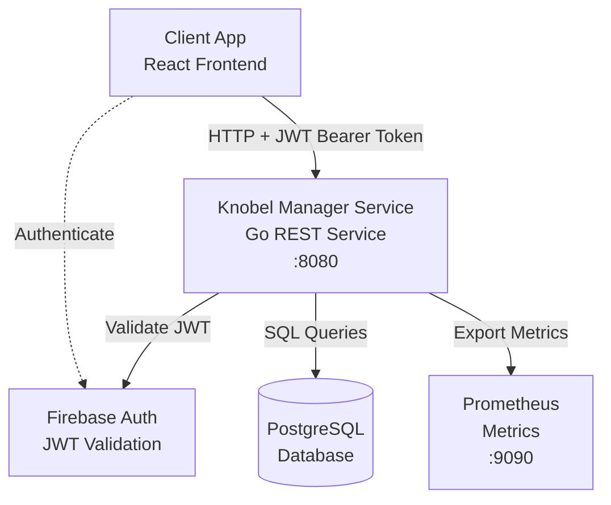

# CLAUDE.md

This file provides guidance to Claude Code (claude.ai/code) when working with code in this repository.

## Project Overview

This is a Go REST API service for managing "Knobeln/Schocken" (dice game) tournaments. It provides endpoints for
managing games, teams, players, rounds, tables, and scores. The project uses OpenAPI-first design with generated server
code, PostgreSQL for persistence, and Firebase JWT for authentication.

Frontend: [knobel-manager-app](https://github.com/henok321/knobel-manager-app) (React)

## Prerequisites

- [Go](https://go.dev/doc/install)
- [Docker](https://docs.docker.com/get-docker/)
- [pre-commit](https://pre-commit.com/) (`pip install pre-commit`)

## Development Commands

### Initial Setup

```bash
make setup
```

Sets up the development environment: installs pre-commit hooks, starts PostgreSQL via Docker Compose, and creates `.env`
file with credentials. Database migrations run automatically at application startup via `goose`.

Before running setup, download Firebase credentials from the Firebase Console and save as `firebaseServiceAccount.json`
in the project root.

### Database

```bash
make reset                    # Stops and removes docker database, uninstalls pre-commit hooks
docker compose up -d          # Start PostgreSQL manually
docker compose down --volumes # Stop and remove database
```

Migrations are in `db_migration/` and use `goose`. They run automatically when the application starts (`cmd/main.go`),
not during `make setup`.

### OpenAPI Code Generation

```bash
make openapi-generate   # Generate code from spec (when spec changes)
make openapi-validate   # Validate generated code matches spec (CI/CD)
```

Generated code is **checked into git** in the `gen/` directory. This approach:

- Makes code reviews easier (see exactly what changed)
- Speeds up CI/CD (validation instead of generation)
- Tracks generated code changes in git history

**Workflow:**

1. Edit `openapi/openapi.yaml`
2. Run `make openapi-generate`
3. Review changes with `git diff gen/`
4. Commit both spec and generated code together

**Validation:**

CI/CD runs `make openapi-validate` in parallel with lint and test jobs. The build job only proceeds if all three pass.

### Linting

```bash
make lint       # Runs go fmt and golangci-lint (Go only, fast)
make lint-all   # Runs all pre-commit hooks (golangci-lint, sqlfluff, shellcheck, markdownlint, etc.)
```

`make lint` is for quick Go-only linting during development. `make lint-all` runs the complete pre-commit hook suite for
comprehensive validation before committing.

### Testing

```bash
make test                        # Runs all tests
go test -v ./...                # Run tests directly (same as make test)
go test -v ./pkg/game/...       # Run specific package tests
go test -v -run TestName ./...  # Run specific test
go test -race ./...             # Run tests with race detector

# Coverage (manual)
go test ./... -coverpkg=./... -coverprofile=coverage.out  # Generate coverage
go tool cover -html=coverage.out                           # View HTML report
go tool cover -func=coverage.out                           # View text report
```

### Building

```bash
make build     # Builds binary
make clean     # Removes build artifacts
```

### Running the Application

```bash
# Load environment variables
set -o allexport
source .env
set +o allexport

# Run from source
go run cmd/main.go

# Or run built binary
./knobel-manager-service
```

The service starts two servers:

- Main API server: `http://localhost:8080`
- Metrics server: `http://localhost:9090/metrics` (Prometheus)

Health check: `curl http://localhost:8080/health`

The app also serves the OpenAPI spec at `/openapi.yaml` and Swagger UI at `/docs`.

### Update Dependencies

```bash
make update  # Updates Go modules (go get -u && go mod tidy)
```

### Available Commands

```bash
make help    # Display all available Makefile targets
```

## Architecture

### System Overview


```mermaid
graph TB
    Client[Client App<br/>React Frontend]
    API[Knobel Manager Service<br/>Go REST Service<br/>:8080]
    DB[(PostgreSQL<br/>Database)]
    Firebase[Firebase Auth<br/>JWT Validation]
    Metrics[Prometheus<br/>Metrics<br/>:9090]
    Client -->|HTTP + JWT Bearer Token| API
    Client -.->|Authenticate| Firebase
    API -->|Validate JWT| Firebase
    API -->|SQL Queries| DB
    API -->|Export Metrics| Metrics
```

The system uses:

- **OpenAPI-First**: Server interfaces generated from `openapi/openapi.yaml` using `oapi-codegen`
- **Database**: PostgreSQL with GORM, migrations via `goose`
- **Authentication**: Firebase JWT tokens validated on each request
- **Deployment**: GitHub Actions CI/CD pipeline
- **Monitoring**: Prometheus metrics at `:9090/metrics`, health endpoints at `:8080/health/live` (liveness) and
  `:8080/health/ready` (readiness)

### Code Organization

```shell
cmd/                    # Application entry point
  main.go              # Server initialization, Firebase setup, DB migrations, routing

api/                   # HTTP layer
  routes/              # HTTP route setup with middleware chain
  handlers/            # HTTP handlers implementing OpenAPI interfaces
  middleware/          # Authentication, logging, metrics, security headers
  health/              # Health check implementations (DB, Firebase)
  logging/             # Structured logging with context

pkg/                   # Domain modules (independent, reusable)
  game/                # Game management
  team/                # Team management
  player/              # Player management
  table/               # Table/round management (also handles scores)
  audit/               # Audit log: connection setup with actor propagation, read repository and service
  setup/               # Game setup algorithms (table assignments)
  entity/              # Shared database models
  apperror/            # Application sentinel errors

gen/                   # OpenAPI-generated code (DO NOT EDIT MANUALLY)
  health/, games/, teams/, players/, tables/, scores/
                       # Generated types, handler interfaces and routing

openapi/               # OpenAPI specification
  openapi.yaml         # Main OpenAPI spec
  swagger.html         # Swagger UI served at /docs
  config/              # oapi-codegen configuration files per module

db_migration/          # Database migrations (goose)
integrationtests/      # Integration tests using testcontainers
```

### Domain Module Pattern

Each domain module (`pkg/game`, `pkg/team`, `pkg/player`, `pkg/table`) follows this structure:

- `repository.go` - Database operations (GORM), exported concrete struct (e.g. `*GamesRepository`)
- `service.go` - Business logic, exported concrete struct (e.g. `*GamesService`)

Modules are wired directly in `api/routes/routes.go` (e.g. `game.NewGamesService(game.NewGamesRepository(db))`)
and injected into handlers as concrete pointer types. Note: scores are handled by `TablesHandler` — there is no
separate scores domain module in `pkg/`.

### OpenAPI-First Development

1. Edit `openapi/openapi.yaml` to add/modify endpoints
2. Update relevant config files in `openapi/config/` if needed
3. Run `make openapi-generate` to regenerate server interfaces
4. Review generated code changes with `git diff gen/`
5. Implement new interfaces in `api/handlers/`
6. Wire up routes in `api/routes/routes.go`
7. Commit both spec and generated code together

The generated code in `gen/` provides:

- Type-safe request/response models
- Server interfaces to implement
- Request validation
- HTTP routing helpers

### Generated Type Usage Pattern

**IMPORTANT: All authenticated-endpoint code generates into one package, `gen/api`.**

oapi-codegen generates a single package (`gen/api`) covering every authenticated tag (Games, Teams, Players, Tables,
Scores). It contains one copy of every schema type, one combined `api.ServerInterface` with all 16 operations, and the
shared HTTP routing helpers. `gen/health` stays its own package because it uses public (unauthenticated) middleware.

**✅ Correct Usage:**

- Use unified `api.*` types: `api.Game`, `api.Team`, `api.Player`, `api.Table`, `api.Score`, etc.
- Converters in `api/handlers/converters.go` return `api.*` types — one converter per entity (e.g. `entityGameToAPIGame`)
- Handlers use `api.*` types for requests and responses
- Services use `api.*` types for request parameters (e.g. `api.GameCreateRequest`, `api.ScoresRequest`)
- The modular handlers (`GamesHandler`, `TeamsHandler`, `PlayersHandler`, `TablesHandler`) are kept, each implementing
  its slice of operations. They are composed into one `api.ServerInterface` via an embedded combined server in
  `api/routes/routes.go`:

```go
type apiServer struct {
    *handlers.GamesHandler
    *handlers.TeamsHandler
    *handlers.PlayersHandler
    *handlers.TablesHandler
}
var _ api.ServerInterface = (*apiServer)(nil)
```

Go method promotion makes the embedded handlers satisfy the combined interface. `TablesHandler` implements both the
Tables and Scores operations. Routing is registered once via `api.HandlerWithOptions(&apiServer{...}, ...)`.

**Examples:**

```go
import "github.com/henok321/knobel-manager-service/gen/api"

// converter returns api.Game
func entityGameToAPIGame(e entity.Game) api.Game { ... }

func (h *GamesHandler) GetGames(w http.ResponseWriter, r *http.Request) {
apiGames := make([]api.Game, len(allGames))
response := api.GamesResponse{Games: apiGames}
}

// service uses api.GameCreateRequest
func (s *GamesService) CreateGame(ctx context.Context, sub string, game *api.GameCreateRequest) (entity.Game, error) { ... }
```

**Why this pattern?**

- One set of types, no per-tag duplication of identical schemas
- One `ServerInterface` to satisfy, while domain logic stays split across the modular handlers
- Simpler configuration — a single `openapi/config/api.yaml` with `include-tags`

**File references:**

- Unified types and interface: `gen/api/api.gen.go`
- Health (separate, public): `gen/health/health.gen.go`
- Converters: `api/handlers/converters.go`
- Handlers: `api/handlers/*_handler.go`
- Combined server + routing: `api/routes/routes.go`
- Services: `pkg/*/service.go`

### Database Models

Core entities in `pkg/entity/model.go`:

- `Game` - Tournament container with configuration (team size, table size, rounds)
- `GameOwner` - Links games to Firebase user IDs
- `Team` - Group of players
- `Player` - Individual participant
- `Round` - Game round container
- `GameTable` - Table assignment for a round (DB name: `game_tables`)
- `Score` - Player score at a specific table
- `TablePlayer` - Many-to-many join table (DB name: `table_players`)

### Enum Pattern

**Prefer String Enums for readability.**

Unless you are writing mission-critical financial code where a state mismatch costs millions, just use String Enums. The readability benefit outweighs the lack of strict type safety in most Go projects.

String enums are simple, JSON-compatible, database-friendly, and easy to debug. They make code more maintainable by being self-documenting.

### Authentication & Authorization

- Uses Firebase JWT tokens via `Authorization: Bearer <token>` header
- Authentication middleware in `api/middleware/auth.go`
- Extracts user ID (`sub` = Firebase UID) and email from token, stores in request context via `middleware.UserFromContext`
- Authorization checks happen in services (e.g., verifying game ownership via `entity.IsOwner`)
- Application errors use sentinel errors in `pkg/apperror` (e.g., `apperror.ErrNotOwner`, `apperror.ErrTeamNotFound`)

### Middleware Chain

Configured in `api/routes/routes.go`:

- Public endpoints: `SecurityHeaders → Metrics → RequestLogging`
- Authenticated endpoints: `SecurityHeaders → Metrics → RequestLogging → Authentication`

### Scores Architecture Note

The Scores operations are part of the unified `gen/api` package, but **scores are implemented by `TablesHandler`**
(`api/handlers/tables_handler.go`), not a dedicated scores handler. There is no `pkg/scores` domain module.
`TablesHandler` provides both the Tables and Scores methods of `api.ServerInterface`; it is embedded in the combined
`apiServer` in `api/routes/routes.go`.

### Game Lifecycle

`setup → in_progress → completed`, plus one step back: `in_progress → setup`, and only while no score has been
entered. Everything else — any move out of `completed`, a rewind that would orphan scores, a status outside the enum —
is refused (`apperror.ErrInvalidStatusTransition`, 409; unknown values are 400 from the handler via the generated
`GameStatus.Valid()`). `status` is optional in `GameUpdateRequest` — absent means "leave it alone", which is why
it is a pointer in the generated type. `ensureTransitionAllowed` in `pkg/game/service.go` is the whole rule. Without the direction
check, `PUT status=setup` followed by `DELETE /setup` wiped a finished tournament in two requests, both 2xx.

`UpdateGame` runs under the same row lock as a setup run and decides from `GamesRepository.CountRelated` — rounds,
players and scores in one query — rather than from preloaded associations, for the reason given below: a slice nobody
loaded looks exactly like an empty one, and "no scores" is the answer that lets a rewind through.

Scores can only be written while the game is `in_progress` (`apperror.ErrGameNotInProgress`, 409). That is what makes
the rewind rule airtight: a game in `setup` cannot have scores, so `DELETE /setup` cannot destroy any.

`teamSize`, `tableSize` and `numberOfRounds` are frozen once the tables are assigned — the same guard as for teams and
players. A game that goes `in_progress` advertising `tableSize: 2` while its tables seat four breaks every score
submission. Renaming stays free in every status.

### Changing Teams and Players After Setup

Creating or deleting a team or a player runs inside `GamesService.WithinSetup`, which is the only path allowed to
change the teams of a game. In one transaction it locks the game row (`SELECT … FOR UPDATE`), checks ownership, counts the
game's rounds and calls `entity.EnsureSetupNotAssigned(status, rounds)`: 409 unless the game is in `setup`
(`apperror.ErrGameNotEditable`) and no round is assigned (`apperror.ErrGameAlreadySetUp`). Without it a late-arriving
team could be added after the tables were assigned and the game started with players seated nowhere.

Three details of that transaction are load-bearing:

- **The lock, not just the check.** `AssignTables` and `ResetSetup` take the same row lock, so a team insert cannot
  interleave with a setup run. Without it both requests succeed and the team ends up in a fully assigned game seated
  nowhere — `TestConcurrentTeamCreateAndSetup` reproduces exactly that, 3 runs out of 3, if the lock is removed.
- **A `COUNT`, not `len(game.Rounds)`.** An association that was never preloaded is indistinguishable from an empty
  one, so a guard reading the slice fails *open* — silently, with every test still green — the day a query drops a
  `Preload`. `EnsureSetupNotAssigned` therefore takes the count as an argument.
- **`AssignTables` loads the game after taking the lock**, not before. A snapshot taken earlier can miss a team that
  committed in between, and the assignment would be built without it.

Nothing happens implicitly: `DELETE /games/{gameID}/setup` discards the assignment explicitly, so the way back is
`DELETE setup → add or remove the team → POST setup`. `TestAddTeamAfterSetup` pins that sequence, down to the added
team's players appearing in `table_players`. Resetting also deletes the scores of the discarded tables
(`ResetGameTables`, deliberately — see the audit section); the lifecycle rules above are what keep that from ever
destroying real scoring history.

Creating and renaming are separate repository methods on purpose — `CreateTeam`/`UpdateTeamName`,
`CreatePlayer`/`UpdatePlayerName`. Create needs GORM's association cascade (a team is inserted with its players); a
rename must not have it, because the entity it was loaded from carries its team, game and rounds, and `Save` walks
that chain and upserts every row it finds. The rename methods therefore update the single column on the single row.
Renaming leaves the assignment intact and stays allowed in every status.

### Audit Log

Changes to `games`, `game_owners`, `teams`, `players` and `scores` are recorded in `audit_events` by Postgres row
triggers (`db_migration/0011_audit_events.sql`). There is no application code on the audit write path and no diffing:
`to_jsonb(OLD)` and `to_jsonb(NEW)` carry before and after.

`rounds`, `game_tables` and `table_players` are deliberately not audited — they are produced by the setup algorithm,
not edited by a human, and one setup run would write hundreds of rows.

**The log records one event per user action, not one row per changed row.** Deletes that cascade are recorded only at
the level the request acted on: deleting a game records one `games` event, and deleting a team records one `teams`
event, not one per orphaned player or score. Two consequences are worth knowing before relying on the log:

- "When did player P disappear?" is unanswerable if P went with its team. The parent event is the only trace, and its
  `old_row` holds no child data.

Re-running setup is the exception that proves the rule, and it is worth knowing why. `ResetGameTables`
(`pkg/game/repository.go`) deletes `scores` **explicitly** before it drops `game_tables`, so each score still resolves
its game through the parents that are still standing and is recorded and attributed to the caller. Had it relied on the
cascade, the same rows would have been suppressed and a tournament's entire scoring history would have vanished
silently. `TestAuditActor` pins this: a setup re-run records one `scores`/`delete` event per wiped score. Preserve the
delete order if you touch that function.

Three mechanics are not obvious, and the first two were measured to behave the opposite of the expectation:

- `pkg/audit/open.go` registers its callback at `Before("gorm:create")`, not `After("gorm:begin_transaction")`. At the
  latter, `Statement.ConnPool` is still the `*sql.DB` pool, so the setting lands on an arbitrary connection and every
  audit row records `system`.
- Cascade deletes are suppressed by checking whether the row can still reach a live game, not by `pg_trigger_depth()`.
  Referential-integrity cascades run at depth 1, exactly like a direct delete.
- Updates that change nothing are suppressed by comparing the rows with `updated_at` removed. GORM's `Save` emits an
  `UPDATE` unconditionally and always bumps `updated_at`, and Postgres fires row triggers even when no value differs.

Both entry points — `cmd/main.go` and `integrationtests/integration_test.go` — open the connection through
`audit.OpenDatabase`, which registers those callbacks. A harness that calls `gorm.Open` directly records `system` for
everything, which `TestAuditActor` fails on.

Failed requests leave no trace: validation (400), authorization (403) and missing-row (404) failures never reach a
write, so no trigger fires.

Reads go through the normal layering: `GET /games/{gameID}/audit` → `AuditHandler` → `audit.EventsService` (ownership
check) → `audit.EventsRepository`. The design rationale, including the rejected alternatives, is in
`docs/superpowers/specs/2026-08-29-audit-log-design.md`.

Authorization is in two halves because `audit_events.game_id` has no foreign key and a game's trail deliberately
outlives the game. While the game exists, `game_owners` decides. Once it is gone, the trail authorizes itself against
the `game_owners` events it recorded, so a former owner can still read the deletion. Anyone else gets 404 either way,
learning nothing about whether the game ever existed.

The response carries whole table rows in `old`/`new`, so **adding a column to an audited table publishes it to every
owner of that game** with no code change. `TestAuditLogEndpoint` pins the exposed key set for all five audited tables,
so widening fails a test rather than happening silently. The corollary is that **renaming or dropping a column in an
audited table is a breaking API change**: the frontend reads `new.game_name` directly, and historical rows keep the old
key forever, so a rename forces clients to handle both shapes indefinitely.

Two limitations are known and deliberately not addressed:

- **The log is not tamper-evident.** The application's database role owns `audit_events` and its triggers, so a
  compromised service can rewrite or disable its own audit trail. `REVOKE UPDATE, DELETE, TRUNCATE` would fix it and
  is the right move if this ever needs to prove anything to a third party; it is over-engineering for a tournament app.
- **`game_id` is not tied to a game's incarnation.** There is no foreign key (by design, so trails outlive games) and
  no immutable game key, so a `setval` or a `pg_restore` that rewinds the sequence could let a new game inherit a
  deleted one's trail. Not reachable through the API — `nextval` never goes backwards on its own.

## Test Setup

Integration tests (`integrationtests/`) use:

- `testcontainers-go` to spin up PostgreSQL containers
- Mock Firebase auth client (`integrationtests/mock/auth_mock.go`)
- Real database operations with full goose migrations
- `httptest.Server` wrapping the real router

Tests are automatically run by pre-commit hooks on push and by CI/CD.

## Tools Required

The project uses Go toolchain directives:

- `github.com/oapi-codegen/oapi-codegen/v2/cmd/oapi-codegen` - OpenAPI code generation
- `github.com/pressly/goose/v3/cmd/goose` - Database migrations

These are listed in `go.mod` and installed via `go tool <command>`.

## Environment Variables

Required in `.env`:

- `ENVIRONMENT` - Set to `local` for development (enables debug logging)
- `FIREBASE_SECRET` - Base64-encoded Firebase service account JSON
- `DATABASE_URL` - PostgreSQL connection string
- `DB_MIGRATION_DIR` - Path to migrations directory (e.g., `db_migration`)

## CI/CD

GitHub Actions workflows in `.github/workflows/`:

- **pipeline.yml** - Complete CI/CD pipeline (lint → test → build → deploy)
- **codeql.yml** - Security and code quality analysis (CodeQL)

### Deployment Pipeline

Single workflow runs on push to main with dependent jobs:

1. **Validate, Lint & Test** - Run in parallel
    - Validate OpenAPI: Ensures generated code matches spec (`make openapi-validate`)
    - Lint: Pre-commit hooks (golangci-lint, gitleaks, shellcheck, markdownlint, etc.)
    - Test: Full test suite (`make test`)
2. **Build** - Triggers after all validations pass:
    - Builds multi-arch Docker image (amd64/arm64)
    - Pushes to GitHub Container Registry (`ghcr.io`)
3. **Deploy** - Only from `main`, tracked via GitHub Environments (production):
    - Runs `ansible-playbook deploy/deploy.yml` against the VPS as `root`. It writes
      `/srv/knobel-manager/{compose.yaml,.env}` plus `/srv/edge/sites/knobel-manager.caddy`, then
      `docker compose up -d --wait`, so the server never drifts from the repo
    - The **host** is not this repo's job. Docker, firewall, swap, SSH, backups and the shared Caddy
      come from [henok321/homelab](https://github.com/henok321/homelab); `deploy.yml` asserts
      `/srv/edge` exists and refuses to run otherwise
    - `deploy/deploy.yml` is the source of truth for this service's server state; `DEPLOYMENT.md`
      covers only what it cannot express (routing contract, secret handling, manual operations)

**On Pull Requests:** Only validation, lint, and test jobs run (build/deploy are skipped)

### Security and Quality Analysis (CodeQL)

- Runs on push to main, PRs, and weekly (Thursday 01:44 UTC)
- Analyzes Go code and GitHub Actions workflows
- Excludes generated code (`gen/`), vendor, tests, migrations
- Results: [GitHub Security](https://github.com/henok321/knobel-manager-service/security)
- `govulncheck` runs in pre-commit hooks for dependency CVE scanning

### Test Coverage

**Local development:**

- Generate coverage: `go test ./... -coverpkg=./... -coverprofile=coverage.out`
- View report: `go tool cover -html=coverage.out`

**Coverage exclusions:** `integrationtests/`, `gen/`, `cmd/`

### Health Verification

```bash
curl https://api.knobel-manager.de/health/live
curl https://api.knobel-manager.de/health/ready
```

### Required GitHub Secrets & Variables

- **Variables:** `VPS_HOST` (server IP or hostname), `VPS_HOST_KEY` (`ssh-keyscan` line, pinned into
  `known_hosts`)
- **Secrets:** `VPS_SSH_KEY` (private key for `root`), `DB_PASSWORD` and `FIREBASE_SECRET` (rendered into
  `/srv/knobel-manager/.env` by the playbook)

`ACME_EMAIL` moved to the homelab repo along with Caddy.

`DB_PASSWORD` must match the password already stored in the `db-data` volume: Postgres ignores
`POSTGRES_PASSWORD` on an initialised data directory, so changing the secret alone leaves the app unable
to authenticate and the deploy red. `ALTER USER` first, then the secret — see `DEPLOYMENT.md`. It also
has to survive Compose interpolation: `.env` is Compose's own variable source, so a `$` in the value is
expanded away and `FIREBASE_SECRET` must be unwrapped base64 (`base64 -w0`).

---

## Code Review Standards

### Review Philosophy

- Be direct and honest in feedback - focus on quality and fact
- Identify security vulnerabilities and bugs as the highest priority
- Focus on code quality and correctness over style preferences
- Suggest improvements that enhance maintainability, but avoid major refactoring unless it significantly improves
  quality
- Follow the boyscout rule: "Leave the campground cleaner than you found it"
- Acknowledge well-implemented patterns and good practices

When reviewing code changes, apply these standards with appropriate severity:

### Critical Issues (Block merge)

- Security vulnerabilities (SQL injection, command injection, exposed secrets)
- Data corruption risks
- Unhandled errors that could crash the service
- Breaking API changes without version bump
- Race conditions or deadlocks

### High Priority Issues (Should fix before merge)

- Incorrect business logic
- Missing authorization checks (verify game ownership in services)
- Inefficient database queries (N+1 queries, missing preloading)
- Missing tests for critical paths
- Violation of project architecture patterns (business logic in handlers, bypassing OpenAPI workflow)

### Medium Priority Issues (Fix or document decision)

- Code duplication
- Missing error context (use fmt.Errorf with %w)
- Unclear variable names
- Suboptimal performance
- Missing edge case handling

### Common Anti-Patterns to Avoid

- Business logic in HTTP handlers (should be in services)
- Direct database access from handlers (use repositories)
- Skipping authorization checks in service layer
- Editing generated code in `gen/` directory
- Using `interface{}` when specific types could be used
- Ignoring errors with `_`
- Not closing resources (missing `defer` for files/connections)
- Hardcoding configuration values
- Creating new sentinel errors instead of using `pkg/apperror`

### Project Best Practices to Encourage

- Following domain module pattern (repository.go, service.go; concrete struct types, no interfaces)
- Clear separation: handler → service → repository
- Using sentinel errors from `pkg/apperror` (e.g., `apperror.ErrNotOwner`, `apperror.ErrTeamNotFound`)
- Comprehensive error handling with context
- Proper transaction handling for multi-step database operations
- Using middleware for cross-cutting concerns
- Structured logging with request context
- Integration tests that verify full request flow
- Prefer integration tests over unit tests unless testing algorithmic complexity
- Tests should test behavior, not implementation details
- Pass context through function calls
- Table-driven tests with t.Run for subtests

---

**Note for Claude Code:** Be direct and honest, do not sugar coat answers, focus on quality and fact.
