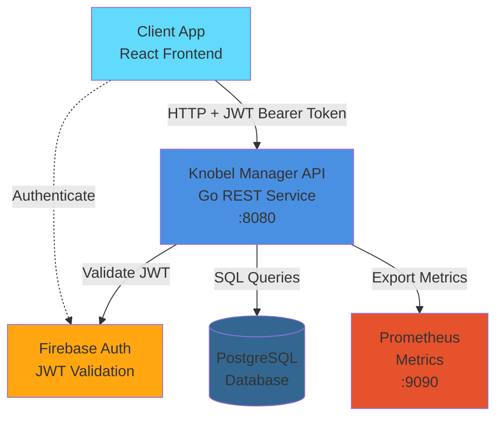

# Knobel Manager Service

[](https://github.com/henok321/knobel-manager-service/actions/workflows/CI.yml)
[](https://github.com/henok321/knobel-manager-service/actions/workflows/deploy.yml)
[](https://sonarcloud.io/summary/new_code?id=henok321_knobel-manager-service)

## Overview

REST API service for the dice game "Knobeln" (aka "Schocken") tournament manager. Built with Go, OpenAPI-first design,
PostgreSQL, and Firebase JWT authentication.

**Frontend**: [knobel-manager-app](https://github.com/henok321/knobel-manager-app) (React)

## Architecture



The system uses a client-server model:

- **OpenAPI-First**: Server interfaces generated from `spec/openapi.yaml` using `oapi-codegen`
- **Database**: PostgreSQL with GORM, migrations via `goose`
- **Authentication**: Firebase JWT tokens validated on each request
- **Deployment**: GitHub Actions CI/CD pipeline deploying to Fly.io
- **Monitoring**: Prometheus metrics at `:9090/metrics`, health endpoint at `:8080/health`

## Prerequisites

- [Go](https://go.dev/doc/install)
- [Docker](https://docs.docker.com/get-docker/)
- [pre-commit](https://pre-commit.com/) (`pip install pre-commit`)
- Firebase service account credentials (see Setup)

## Setup

1. Download Firebase credentials
   from [Firebase Console](https://console.firebase.google.com/u/1/project/knobel-manager-webapp/settings/serviceaccounts/adminsdk)
   and save as `firebase-credentials.json`
2. Run setup:

   ```sh
   make setup  # Installs hooks, starts database, runs migrations, creates .env
   ```

## Environment Variables

Required variables (set by `make setup` in `.env` for local development):

| Variable          | Description                                                        |
|-------------------|--------------------------------------------------------------------|
| `FIREBASE_SECRET` | Base64-encoded Firebase service account JSON                       |
| `DATABASE_URL`    | PostgresSQL connection string                                      |
| `ENVIRONMENT`     | Environment name (`local` for debug logging, otherwise info level) |

Optional variables (with defaults):

| Variable                            | Default   | Description                          |
|-------------------------------------|-----------|--------------------------------------|
| `RATE_LIMIT_REQUESTS_PER_SECOND`    | `20`      | Rate limit requests per second       |
| `RATE_LIMIT_BURST_SIZE`             | `40`      | Rate limit burst size                |
| `RATE_LIMIT_CACHE_DEFAULT_DURATION` | `5m`      | Cache duration (e.g., `5m`, `1h`)    |
| `RATE_LIMIT_CACHE_CLEANUP_PERIOD`   | `1m`      | Cache cleanup period (e.g., `1m`)    |
| `MAX_REQUEST_SIZE`                  | `1048576` | Max request body size in bytes (1MB) |

## Development

```sh
make openapi                 # Generate server code from OpenAPI spec
source .env                  # Load environment variables
go run cmd/main.go           # Start API server (localhost:8080)
```

Database commands:

```sh
make reset                   # Reset database
docker compose up -d         # Start PostgreSQL
docker compose down -v       # Stop and remove database
```

## Code Quality

```sh
make lint                   # Run golangci-lint only (fast)
make lint-all               # Run all pre-commit hooks (includes OpenAPI generation)
make test                   # Run tests
make test-coverage          # Generate coverage reports
```

## Build & Deploy

```sh
make build                  # Build binary (runs tests first)
./knobel-manager-service    # Run binary (requires sourced .env)
```

Deployment to Fly.io happens automatically via GitHub Actions on push to main.

## Maintenance

```sh
make update                  # Update pre-commit hooks and Go modules
make clean                   # Remove build artifacts
make help                    # List all Makefile targets
```

## License

Licensed under MIT License (see [LICENSE](LICENSE) file for details).
